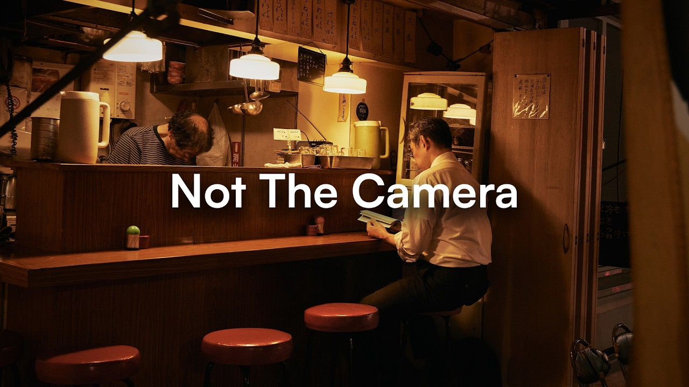
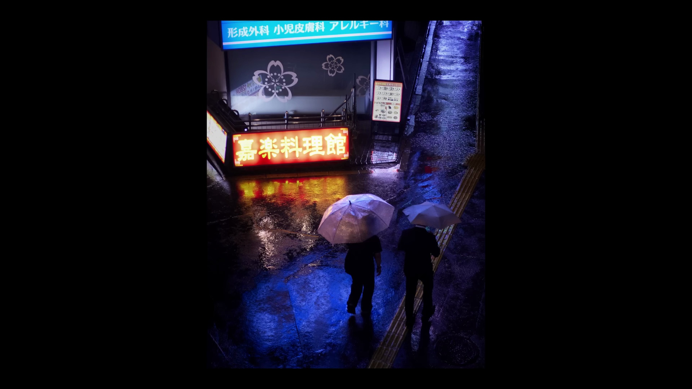
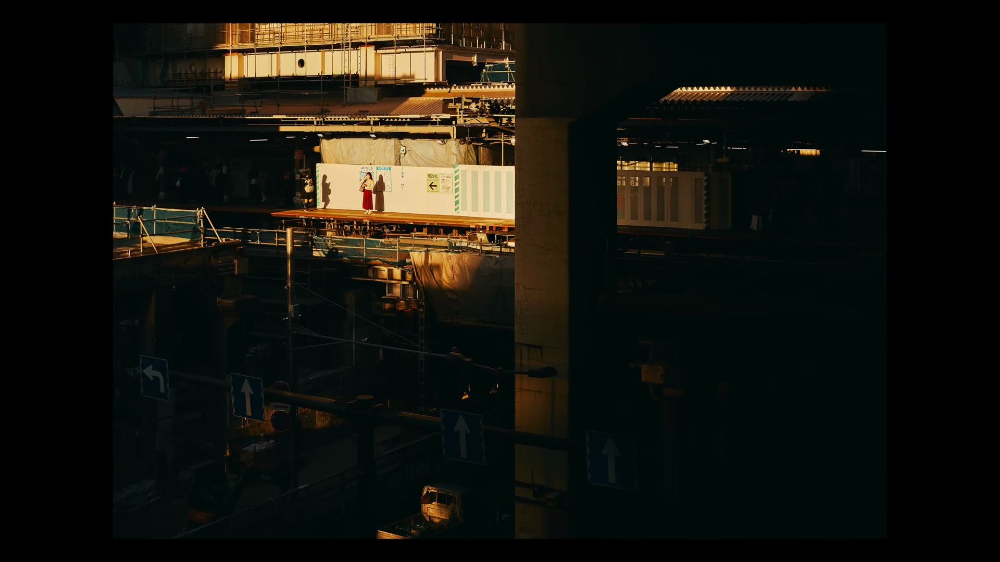
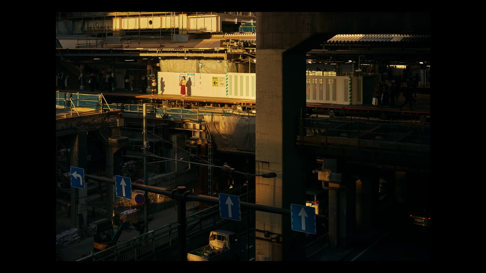
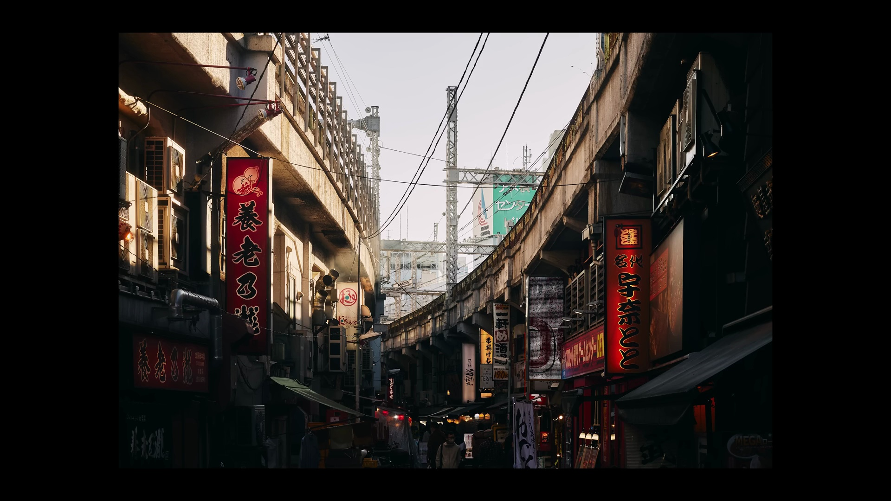
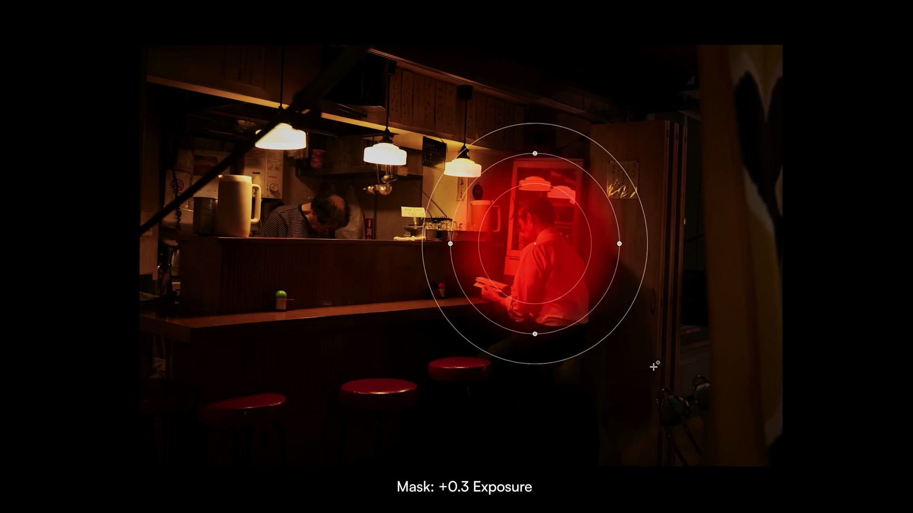
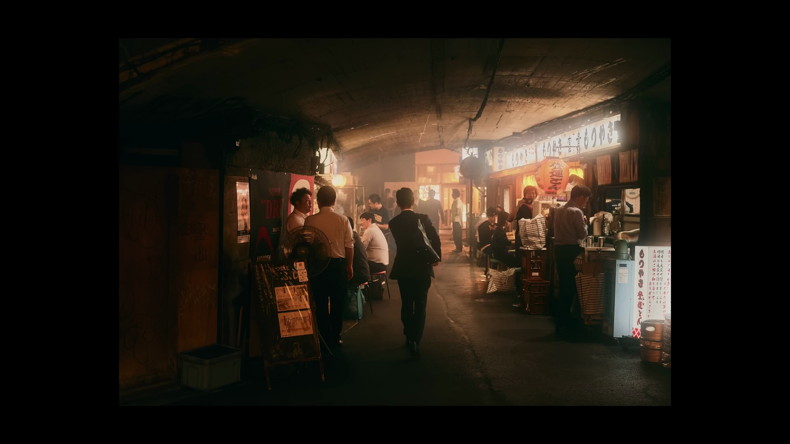
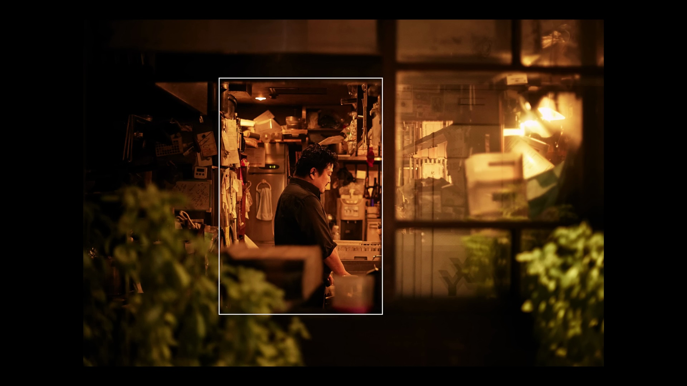

Example Output
==============

Below is a real example generated by YouTube to Notes from the video
`"Why Your Photos Don't Look Cinematic (It's Not Your Camera)" <https://www.youtube.com/watch?v=CEb4s3TGWOw>`_.
The pipeline produced structured notes with inline screenshots, a table of
contents, and a downloadable PDF — all fully automated.

----

A Comprehensive Guide to Cinematic Photography
-----------------------------------------------

**Source:** https://www.youtube.com/watch?v=CEb4s3TGWOw

Summary
^^^^^^^

This document provides a detailed analysis of the five core principles required to transform standard photographs into cinematic images. It covers the strategic use of shadow and light, the importance of environmental storytelling, specific post-processing techniques for a moody and believable aesthetic, deliberate in-camera settings for color and exposure control, and the role of composition as a final refining element. By mastering these concepts—embracing darkness, prioritizing atmosphere, editing with restraint, controlling camera settings manually, and applying compositional rules effectively—photographers can consistently produce images with the depth, mood, and narrative quality characteristic of cinematic stills.

Table of Contents
^^^^^^^^^^^^^^^^^

1. `Principle 1: The Primacy of Shadow and Light`_
2. `Principle 2: Environmental Storytelling`_
3. `Principle 3: Intentional Post-Processing Techniques`_
4. `Principle 4: Deliberate Camera Settings`_
5. `Principle 5: Composition as a Final Polish`_

Principle 1: The Primacy of Shadow and Light
^^^^^^^^^^^^^^^^^^^^^^^^^^^^^^^^^^^^^^^^^^^^

The foundation of a cinematic aesthetic in photography is a departure from traditional exposure guidelines, which often advocate for perfectly illuminated scenes with visible detail throughout. Cinematic imagery, conversely, derives its power from the intentional use of darkness and shadow. Shadows are not treated as a technical flaw to be corrected but as a powerful tool for sculpting the visual narrative. They are employed to generate mood, create drama, direct the viewer's gaze, and evoke emotional responses by concealing information and fostering a sense of mystery.

The primary technique to achieve this look is to shoot into the shadows, positioning the subject in a scene where the primary light source is located behind or to the side. This creates distinct areas of highlight and shadow. The crucial step is to set the camera's exposure for the brightest parts of the scene (the highlights). This method, known as 'exposing for the highlights,' inherently causes the shadow areas to be underexposed and remain dark in the initial capture. This prevents the loss of detail in the highlights, as overexposed (or 'blown out') white areas contain no recoverable data, while underexposed shadows retain information that can be selectively revealed in post-processing.

A practical application of this principle can be observed in a photograph taken at Shibuya Station. Faced with a complex, dark construction environment, a conventional approach might be to increase the overall brightness to reveal all the structural details. However, this would dilute the image's dramatic impact.

The cinematic quality of the image is derived not from what is visible, but from what is obscured. The expansive darkness, punctuated by a single shaft of light illuminating the subject, creates a narrative focal point. The surrounding shadows shape the scene, infusing it with drama and mystery. The willingness to underexpose in-camera is the critical first step. While shadow detail can be judiciously recovered during editing, preserving the foundational mood established by the initial, dark capture is paramount.

Principle 2: Environmental Storytelling
^^^^^^^^^^^^^^^^^^^^^^^^^^^^^^^^^^^^^^^

Cinematic photography emphasizes the narrative potential of the environment, often elevating it to a status equal to or greater than the human subject. The focus shifts from merely capturing a person to capturing a world and the subject's place within it. The atmosphere, character, and mood of the surrounding space are what imbue the photograph with a cinematic feel.

The key practice is to seek out scenes and locations that possess an inherent feeling or character. This involves evaluating a space for its textures, colors, and, most importantly, its lighting. The fundamental question to ask is whether the location itself could serve as a backdrop for a scene in a film. A photograph can be successful even with a physically small subject, or no subject at all, provided the environment is sufficiently evocative.

Once such an environment is identified, the human subject can be strategically incorporated to provide a sense of scale and context. Placing a small figure within a vast or complex setting emphasizes the relationship between the individual and their world. The interaction of the subject with the environment or with other individuals within that space creates a scenario, transforming a static image into a moment of narrative action. The environment and subject thus work in synergy to tell a story.

Principle 3: Intentional Post-Processing Techniques
^^^^^^^^^^^^^^^^^^^^^^^^^^^^^^^^^^^^^^^^^^^^^^^^^^^^

Post-processing for a cinematic look is an exercise in restraint and subtlety. The goal is to enhance the mood and atmosphere captured in-camera, not to fundamentally reinvent the image. Cinematic photos must remain believable, appearing as heightened, moodier versions of reality. If the lighting and exposure are correctly handled during the shoot, editing becomes a process of stylization rather than correction. Three specific techniques are central to achieving this look.

First is the careful reduction of color saturation. Digital cameras often capture colors with an intensity that can feel unnatural or overly vibrant for a cinematic aesthetic. To counteract this, the vibrance and saturation levels are slightly reduced in post-processing, typically by 5 to 10 points. This adjustment tempers the colors, lending a more subdued and cohesive palette to the image.

Second is the manipulation of the white point using the tone curve. In motion pictures, it is rare to see areas of pure, absolute white (RGB 255, 255, 255). To replicate this, the top-right point of the tone curve is pulled downward. This action 'clamps' the brightest highlights, ensuring they do not reach pure white. The result is a softening of the highlights and the preservation of a moody tonality throughout the entire image, even in its brightest regions.

.. image:: _static/example/CEb4s3TGWOw_0241.jpg
   :alt: The Tone Curve tool in an image editor, with the top-right handle (the white point) pulled down to prevent highlights from clipping to pure white.
   :width: 100%

Third, and most critically, is the selective recovery of shadow detail using local adjustments. While global adjustments like the main 'Shadows' slider can lift all dark areas, this often flattens the image, destroys contrast, and ruins the carefully crafted dark mood. A more refined approach is to use targeted masking tools, such as radial filters or adjustment brushes. These tools allow for precise brightening of specific areas within the shadows—for instance, to reveal a detail in a subject's face or an element in the foreground—without affecting the entire image. This method brings back just enough information to add depth and interest while keeping the overall scene dark and dramatic. Any use of global shadow sliders should be minimal, with significant adjustments reserved for masking.

The guiding principle across all editing is subtlety. The most effective cinematic edit is one that feels invisible to the viewer, enhancing the photograph's inherent qualities without drawing attention to the post-processing itself. Further color grading is a stylistic choice, but it should be built upon this restrained foundation.

Principle 4: Deliberate Camera Settings
^^^^^^^^^^^^^^^^^^^^^^^^^^^^^^^^^^^^^^^^

Achieving a cinematic look begins with intentional in-camera settings that preemptively establish the desired mood and technical quality. Two settings are particularly critical: white balance and exposure.

First, the use of Manual White Balance is non-negotiable. When a camera is set to Auto White Balance (AWB), its algorithm constantly attempts to neutralize color casts and render whites as neutral. This process works directly against the goal of cinematic imagery, which relies on specific color moods—leaning warm, cool, green, or magenta—to convey emotion. While white balance can be adjusted in post-processing, setting it manually in-camera offers a significant advantage: it allows the photographer to visualize the final color palette while shooting. Choosing a manual preset (e.g., 'Cloudy' for warmth, 'Tungsten' for coolness) does much of the heavy lifting for the final color grade.

Second, exposure must be managed to protect highlight detail. As previously discussed, this involves exposing for the highlights. From a technical standpoint, this means monitoring the camera's histogram to ensure that the graph does not 'clip' on the far right side, which indicates blown-out highlights. To achieve this, it is often necessary to intentionally underexpose the image relative to what the camera's meter might suggest as a 'correct' exposure. This often translates to setting the exposure compensation dial to between -1/3 and -1 full stop, depending on the scene's contrast. A darker initial image with preserved highlights is far more flexible in post-processing than a brighter image with irrecoverable white areas.

Principle 5: Composition as a Final Polish
^^^^^^^^^^^^^^^^^^^^^^^^^^^^^^^^^^^^^^^^^^

Composition is the element that provides structure and polish to a cinematic photograph, but it is effective only after the foundational elements of mood, lighting, story, and color have been established. A perfectly composed image that lacks atmosphere will remain a technically sound but emotionally flat snapshot. However, when applied to a scene rich with cinematic qualities, compositional rules elevate the image to a higher level of sophistication.

Established compositional principles remain highly relevant. The Rule of Thirds, which involves placing key elements along an imaginary 3x3 grid, is frequently used to create balance and visual interest. Leading lines—natural or man-made lines within the frame—are employed to draw the viewer's eye through the scene towards a subject or point of interest, enhancing the sense of depth and narrative flow.

Another powerful technique is creating a 'frame within a frame,' which involves using foreground elements such as doorways, windows, or natural foliage to frame the main subject. This adds layers and depth to the image, providing context and focusing attention.

Ultimately, the cinematic look is achieved when all five principles converge: shadow-heavy lighting, environmental storytelling, intentional editing, deliberate settings, and solid composition. While mastering every principle in every shot is not always necessary, successfully implementing even three of these five components will produce work that feels distinct, emotive, and profoundly more cinematic.

----

This entire document — including the structured sections, inline screenshots
at AI-identified timestamps, and table of contents — was generated
automatically by the YouTube to Notes pipeline.
